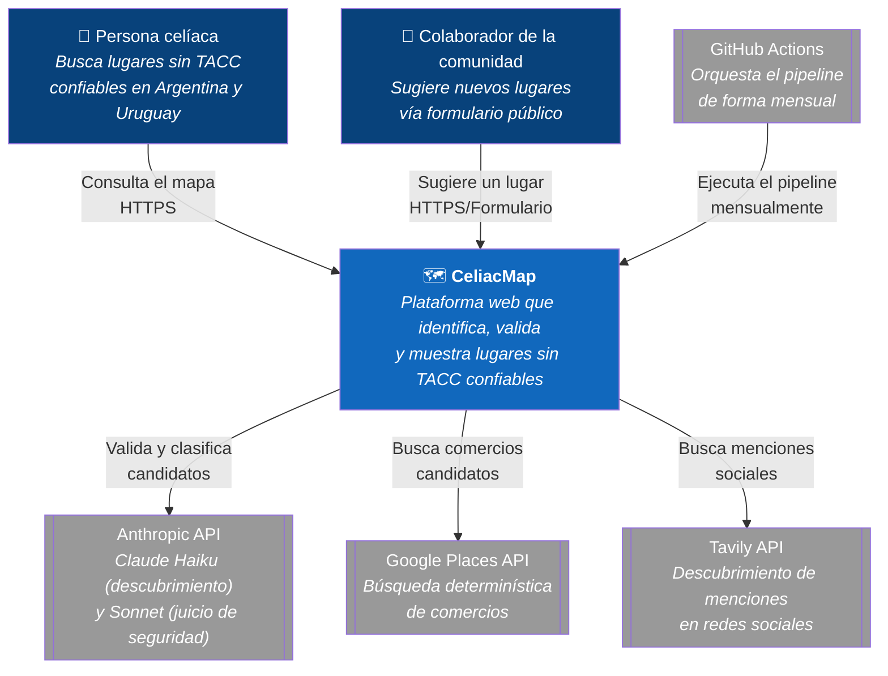
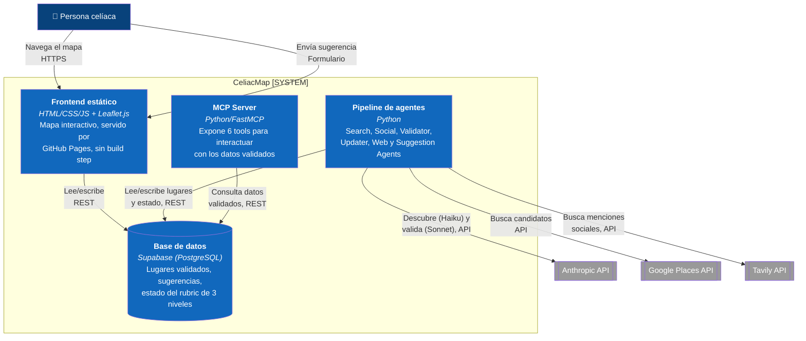

# Diagramas de Arquitectura C4 — CeliacMap

## Nivel 1 — Contexto del sistema

```mermaid
flowchart TB
    usuario["👤 Persona celíaca<br/><i>Busca lugares sin TACC<br/>confiables en Argentina y Uruguay</i>"]
    colaborador["👤 Colaborador de la comunidad<br/><i>Sugiere nuevos lugares<br/>vía formulario público</i>"]

    celiacmap["🗺️ <b>CeliacMap</b><br/><i>Plataforma web que identifica, valida<br/>y muestra lugares sin TACC confiables</i>"]

    anthropic[["Anthropic API<br/><i>Claude Haiku (descubrimiento)<br/>y Sonnet (juicio de seguridad)</i>"]]
    google[["Google Places API<br/><i>Búsqueda determinística<br/>de comercios</i>"]]
    tavily[["Tavily API<br/><i>Descubrimiento de menciones<br/>en redes sociales</i>"]]
    github_actions[["GitHub Actions<br/><i>Orquesta el pipeline<br/>de forma mensual</i>"]]

    usuario -->|"Consulta el mapa<br/>HTTPS"| celiacmap
    colaborador -->|"Sugiere un lugar<br/>HTTPS/Formulario"| celiacmap

    celiacmap -->|"Valida y clasifica<br/>candidatos"| anthropic
    celiacmap -->|"Busca comercios<br/>candidatos"| google
    celiacmap -->|"Busca menciones<br/>sociales"| tavily
    github_actions -->|"Ejecuta el pipeline<br/>mensualmente"| celiacmap

    style celiacmap fill:#1168bd,color:#fff
    style usuario fill:#08427b,color:#fff
    style colaborador fill:#08427b,color:#fff
    style anthropic fill:#999,color:#fff
    style google fill:#999,color:#fff
    style tavily fill:#999,color:#fff
    style github_actions fill:#999,color:#fff
```

## Nivel 2 — Contenedores

```mermaid
flowchart TB
    usuario["👤 Persona celíaca"]

    anthropic[["Anthropic API"]]
    google[["Google Places API"]]
    tavily[["Tavily API"]]

    subgraph celiacmap["CeliacMap [SYSTEM]"]
        frontend["<b>Frontend estático</b><br/><i>HTML/CSS/JS + Leaflet.js</i><br/>Mapa interactivo, servido por<br/>GitHub Pages, sin build step"]
        pipeline["<b>Pipeline de agentes</b><br/><i>Python</i><br/>Search, Social, Validator,<br/>Updater, Web y Suggestion Agents"]
        mcp["<b>MCP Server</b><br/><i>Python/FastMCP</i><br/>Expone 6 tools para interactuar<br/>con los datos validados"]
        db[("<b>Base de datos</b><br/><i>Supabase (PostgreSQL)</i><br/>Lugares validados, sugerencias,<br/>estado del rubric de 3 niveles")]
    end

    usuario -->|"Navega el mapa<br/>HTTPS"| frontend
    usuario -->|"Envía sugerencia<br/>Formulario"| frontend
    frontend -->|"Lee/escribe<br/>REST"| db

    pipeline -->|"Lee/escribe lugares<br/>y estado, REST"| db
    pipeline -->|"Descubre (Haiku) y<br/>valida (Sonnet), API"| anthropic
    pipeline -->|"Busca candidatos<br/>API"| google
    pipeline -->|"Busca menciones<br/>sociales, API"| tavily

    mcp -->|"Consulta datos<br/>validados, REST"| db

    style frontend fill:#1168bd,color:#fff
    style pipeline fill:#1168bd,color:#fff
    style mcp fill:#1168bd,color:#fff
    style db fill:#1168bd,color:#fff
    style usuario fill:#08427b,color:#fff
    style anthropic fill:#999,color:#fff
    style google fill:#999,color:#fff
    style tavily fill:#999,color:#fff
```
